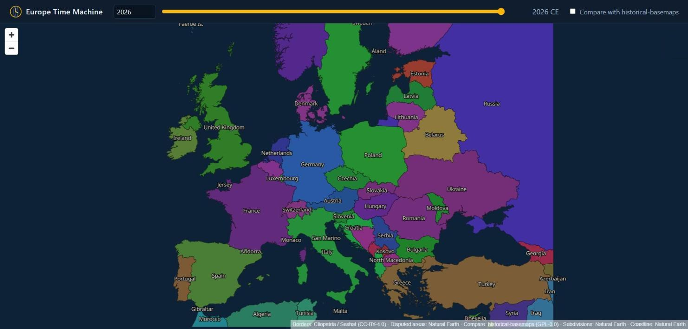
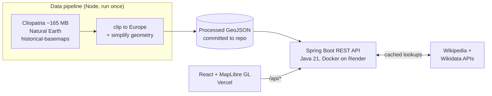

# Europe Time Machine

[](https://github.com/RobertRotaru/EuropeTimeMachine/actions/workflows/ci.yml)


**Live demo: [europe-time-machine.vercel.app](https://europe-time-machine.vercel.app)**

An interactive map of Europe's political borders from 100 BCE to today. Move the year slider,
click a country to zoom in and read about it, and compare the primary dataset against a second
historical-borders source.



## Architecture



| Layer | Stack | Notes |
|---|---|---|
| Backend | Java 21, Spring Boot 4.1, Maven | Loads every dataset into memory at startup and answers year queries without a database. The data is read-only and small once clipped, so memory is the simplest fast option. |
| Frontend | React 19, TypeScript, Vite, MapLibre GL JS, Tailwind CSS | WebGL map rendering, a year slider, an info panel that works on mobile, and an optional comparison overlay |
| Data pipeline | Node.js + Turf.js | Clips and simplifies the worldwide datasets to Europe, taking ~250 MB of raw files down to what the API serves |
| Deploy | Docker (multi-stage) on Render, Vercel | CORS origins and the API URL come from environment variables |
| CI | GitHub Actions | Backend `mvn verify` and frontend lint + type-check + build on every push |

### Design decisions

- **Two border sources, switched by year.** Cliopatria's historical polygons are hand-digitised
  and low-resolution. From the last year Cliopatria covers onward, the API serves Natural
  Earth's survey-grade borders instead, which also include microstates.
- **Present day follows the real clock.** The upper bound of the year range comes from
  `Year.now()` on every request, so the map doesn't freeze at the build date.
- **Disputed territories are their own layer.** Crimea, Transnistria, Abkhazia and others are
  drawn above the base map instead of being merged into whichever country holds them de jure.
- **Entity info is proxied and cached.** The backend combines a Wikipedia summary with
  Wikidata inception and dissolution dates, keyed on IDs that Cliopatria already provides, so no
  fuzzy name matching is needed. It caches the result for the life of the process.

## REST API

| Endpoint | Returns |
|---|---|
| `GET /api/years/range` | Minimum and maximum year available |
| `GET /api/borders?year=1492` | GeoJSON FeatureCollection of the polities that exist in that year |
| `GET /api/borders/disputed?year=2026` | Disputed-territory layer (`204` for historical years) |
| `GET /api/borders/compare?year=1492` | The nearest historical-basemaps snapshot and its year |
| `GET /api/subdivisions?countryCode=ES` | Present-day first-level subdivisions of a country |
| `GET /api/entity?wikipedia=Crown_of_Castile&wikidata=Q217196` | Merged Wikipedia and Wikidata info for a polity |

## Running locally

```bash
# Backend: http://localhost:8080
cd backend && ./mvnw spring-boot:run

# Frontend: http://localhost:5173 (proxies /api to :8080)
cd frontend && npm install && npm run dev

# Tests
cd backend && ./mvnw test
```

## Data sources

- **Borders:** [Cliopatria / Seshat Global History Databank](https://github.com/Seshat-Global-History-Databank/cliopatria) (CC-BY-4.0) for historical years; [Natural Earth](https://www.naturalearthdata.com/) 10m admin-0 for the present day.
- **Disputed territories:** Natural Earth admin-0 disputed areas.
- **Subdivisions:** Natural Earth 10m admin-1 (present day only, since no open dataset covers historical subdivisions).
- **Comparison overlay:** [historical-basemaps](https://github.com/aourednik/historical-basemaps) (GPL-3.0).
- **Entity info:** live Wikipedia and Wikidata lookups.
